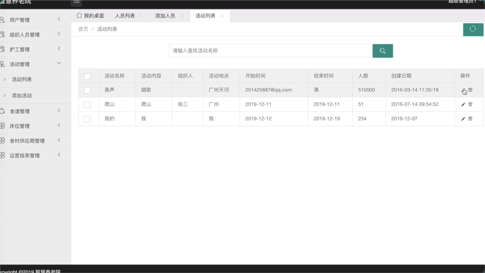

# 智慧养老院系统的设计与实现

基本功能
涉及到的技术：SSM、mysql

随着我国逐渐进入老龄化社会，全社会都在关注老人赡养问题。其中因人口的频繁流动，越来越多的老人选择去养老院度过晚年，这就给各养老院机构带来新的挑战：如何更好的提供服务，来关照老人。伴随着信息化社会的发展建设，应用线上平台进行资源整合、有效沟通，就成为当下养老院新的发展方向。本课题主要是针对智慧养老院系统而构建出一套综合性管理平台，通过本平台可以解决以下问题：

(1)信息发布模块：养老院管理人员，可以发布床位占用信息，为家属预定提供参考;

(2)日常安排管理模块：养老院管理人员可以发布每日食谱、每日活动安排等信息，供家属进行监督；

(3)员工管理模块：养老院管理人员，可以对食材供应商、护工人员、活动组织者，进行统一管理，保证服务质量；

(4)信息公开模块：家属登陆系统，可以预约床位，并且可以对养老院日常工作进行监督以及意见投诉；

(5)预约陪护模块：家属登陆系统，可以查询养老院每日日程安排表，预约合理的陪护时间；

(6)报表管理模块：管理人员使用系统，可以生成运营成本报表，为运营提供决策。

活动表

地点，人数，开始时间，结束时间，组织人，创建时间，活动标题，活动内容，
完成前台家属的基本功能，床位预约，陪护预约，投诉

床位信息表

编号，楼层，房间号，创建时间，状态，类型，价格
发布活动和组织人员是有关联关系的，

食谱设计

日期，早午晚餐类型，菜名，营养价值，价格，热量，备注

护工设计

姓名，性别，年龄，工作时长，满意度，添加日期

食材供应商设计

名称，供应范围，添加时间

家属信息

姓名，用户名，密码，家庭住址，联系方式，注册日期

有问题可以联系QQ：641351484

